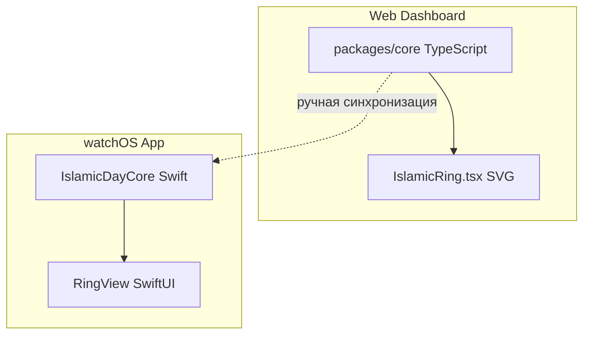

# Apple Watch Islamic Day App — план реализации

## Подключение Apple Watch к Mac

Apple Watch Series 7 **не имеет разъёмов**. Подключение идёт через iPhone:

1. **iPhone** сопряжён с часами (уже есть)
2. **Mac** и **iPhone** в одной Wi‑Fi сети
3. В Xcode: **Window → Devices and Simulators** — выбрать iPhone
4. Сборка и запуск — Xcode ставит приложение на iPhone, iPhone передаёт его на часы

Кабель нужен только для iPhone (если он не в сети).

---

## Архитектура




**Общая логика**: `packages/core` остаётся источником истины. Swift-модуль `IslamicDayCore` — порт с тем же API и формулами. При изменениях в core — обновляем Swift вручную (или по чеклисту).

---

## Итерации

### Итерация 1: Xcode-проект и связка Mac ↔ Watch

**Цель**: Собрать и запустить пустое приложение на физических часах.

- Создать Xcode-проект: iOS App + watchOS App Extension
- Настроить таргеты: iOS (companion), watchOS (основное приложение)
- Добавить watch в схему: Product → Destination → iPhone (часы появятся через него)
- Проверить деплой на физические часы

**Результат**: Пустой экран на часах.

---

### Итерация 2: Swift-порт core-логики

**Цель**: Получить `ComputedIslamicDay` на Swift.

Портировать в Swift (по аналогии с [IslamicDayCore.kt](apps/wear-watchface/app/src/main/java/com/islamicdaydial/watchface/core/IslamicDayCore.kt)):


| Модуль core       | Swift-эквивалент                                         |
| ----------------- | -------------------------------------------------------- |
| `calendar.ts`     | Hijri (Umm al-Qura) — `UmmAlQura` или аналог             |
| `prayer-times.ts` | Adhan — `AdhanSwift` или `PrayerTimes`                   |
| `day-bounds.ts`   | `buildTimeline`                                          |
| `phases.ts`       | `getCurrentPhase`, `getNextTransition`                   |
| `ring.ts`         | `getIslamicDayProgress`, `getMarkers`, `getRingSegments` |
| `snapshot.ts`     | `computeIslamicDaySnapshot`                              |


**Зависимости**:

- [Adhan-Swift](https://github.com/batoulapps/Adhan-Swift) — расчёт намазов
- Umm al-Qura — [UmmAlQuraCalendar](https://github.com/msarhan/ummalqura-calendar-swift) или ручной порт

**Результат**: Swift-модуль, возвращающий `ComputedIslamicDay` (hijriDate, currentPhase, ring.progress, ring.segments).

---

### Итерация 3: UI кольца на watchOS

**Цель**: Кольцо и маркер, как на вебе.

- SwiftUI `Canvas` или `Path` для дуг (аналог `describeArc` из [geometry.ts](apps/web-dashboard/src/lib/geometry.ts))
- Сегменты по `ring.segments` с цветами из [colors.ts](apps/web-dashboard/src/lib/colors.ts) / [segment-gradients.ts](apps/web-dashboard/src/lib/segment-gradients.ts)
- Текущий маркер по `ring.progress` (угол)
- Ночная фаза: тёмный круг + серп (упрощённо, без сложных фильтров)

**Результат**: Кольцо с сегментами и маркером на часах.

---

### Итерация 4: Центр и обновление

**Цель**: Дата, время, название фазы, автообновление.

- В центре: Hijri (2 строки), Eid-подсветка, текущее время
- Таймер обновления (каждую минуту — пересчёт snapshot)
- Локация: из iPhone (Core Location) или дефолт (Mecca)

**Результат**: Полноценный Islamic Day Dial на часах.

---

### Итерация 5: Синхронизация с веб-мордой

**Цель**: Меньше расхождений при изменениях веба.

- Документ **CORE_SPEC.md**: формулы, фазы, границы сегментов, цвета
- Чеклист при правках core: обновить Swift, проверить веб и часы
- При крупных изменениях (новые фазы, Eid) — обновить оба клиента

---

## Структура файлов (watchOS)

```
apps/
  apple-watch/
    IslamicDayDial.xcodeproj
    IslamicDayDial/           # iOS companion (минимальный)
    IslamicDayDialWatch/      # watchOS app
      IslamicDayDialWatchApp.swift
      ContentView.swift
      RingView.swift
      IslamicDayCore/         # Swift-порт core
        Snapshot.swift
        PrayerTimes.swift
        HijriCalendar.swift
        DayBounds.swift
        Ring.swift
        Phases.swift
```

---

## Риски и ограничения

- **watchOS**: нет SVG, Canvas ограничен — градиенты и glow упрощаем
- **Батарея**: частые обновления (например, каждую секунду) могут увеличить расход
- **Локация**: на часах GPS не всегда доступен — лучше брать с iPhone

---

## Порядок действий

1. Установить Xcode (если ещё нет)
2. Создать проект (Итерация 1)
3. Подключить iPhone по кабелю, проверить Wi‑Fi
4. Выбрать iPhone как destination, запустить — приложение появится на часах
5. Далее — Итерации 2–5 по очереди

